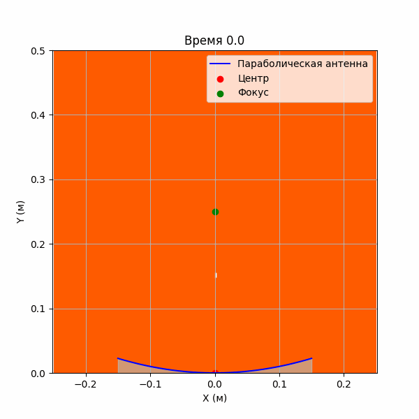
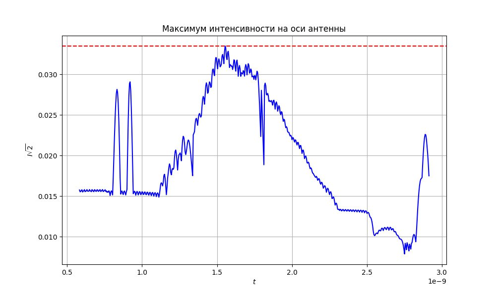

# Моделирование падения электромагнитной волны на антенну
## Введение

В данном проекте рассматривается моделирование падения электромагнитной волны на параболическую антенну. Проект включает в себя численное решение уравнений Максвелла с использованием метода конечных разностей во временной области (FDTD). Целью является визуализация распространения волны, её взаимодействия с антенной и отражения от неё.

---
## Актуальность задачи

Моделирование электромагнитных волн имеет важное значение в радиотехнике: оптимизация антенн для улучшения приема и передачи сигналов.

В данном проекте мы сосредоточимся на моделировании параболической антенны, которая широко используется в спутниковой связи и радиолокации.

---
## Основные физические объекты

### 1. Параболическая антенна
Параболическая антенна представляет собой металлическую поверхность, имеющую форму параболоида вращения. Она фокусирует падающую электромагнитную волну в одну точку — фокус антенны.

#### Параметры антенны:
- **Диаметр**: $ D $ — определяет размер антенны.
- **Фокусное расстояние**: $ f $ — расстояние от центра антенны до фокуса.
- **Геометрическое уравнение**:

  $$
  y = \frac{x^2}{4f}
  $$

  где $ x $ — координата вдоль оси антенны, $ y $ — координата вдоль оси вращения.

### 2. Электромагнитная волна
Электромагнитная волна описывается уравнениями Максвелла:

$$
\nabla \times \mathbf{E} = -\frac{\partial \mathbf{B}}{\partial t}
$$

$$
\nabla \times \mathbf{H} = \frac{\partial \mathbf{D}}{\partial t} + \mathbf{J}
$$

$$
\nabla \cdot \mathbf{D} = \rho
$$

$$
\nabla \cdot \mathbf{B} = 0
$$

Где:
- $ \mathbf{E} $ — напряжённость электрического поля,
- $ \mathbf{H} $ — напряжённость магнитного поля,
- $ \mathbf{D} $ — электрическая индукция,
- $ \mathbf{B} $ — магнитная индукция,
- $ \mathbf{J} $ — плотность тока,
- $ \rho $ — плотность заряда.

Для вакуума:

$$
\mathbf{D} = \epsilon_0 \mathbf{E}, \quad \mathbf{B} = \mu_0 \mathbf{H}
$$

---

## Метод конечных разностей во временной области (FDTD)
Метод FDTD используется для численного решения уравнений Максвелла. Он разбивает пространство на сетку и аппроксимирует производные конечными разностями.

В нашем случае мы рассматривали TE-волну, которая имеет нулевую компоненту вдоль оси $ 0z $.

### Разложение на компоненты

Для плоской волны вдоль оси $ z $ (2D-случай):
- Электрическое поле: $ \mathbf{E} = (E_x, E_y, 0) $
- Магнитное поле: $ \mathbf{H} = (0, 0, H_z) $

Уравнения Максвелла принимают вид:

$$
\frac{\partial E_x}{\partial t} = \frac{1}{\epsilon\epsilon_0} \left( \frac{\partial H_z}{\partial y} \right)
$$

$$
\frac{\partial E_y}{\partial t} = \frac{1}{\epsilon\epsilon_0} \left( -\frac{\partial H_z}{\partial x} \right)
$$

$$
\frac{\partial H_z}{\partial t} = \frac{1}{\mu\mu_0} \left(\frac{\partial E_x}{\partial y} - \frac{\partial E_y}{\partial x}  \right)
$$

### Аппроксимация производных конечными разностями

Производные аппроксимируются центральными разностями:

$$
\frac{\partial f}{\partial x} \approx \frac{f(x + \Delta x) - f(x - \Delta x)}{2 \Delta x}
$$

Применяя это к уравнениям Максвелла, получаем:

#### Для электрического поля ( $ E_x $ и $ E_y $ ):

$$
E_x(t + \Delta t) = E_x(t) + \frac{\Delta t}{\epsilon\epsilon_0 \Delta y} \left( H_z(y + \Delta y) - H_z(y) \right)
$$

$$
E_y(t + \Delta t) = E_y(t) - \frac{\Delta t}{\epsilon\epsilon_0 \Delta x} \left( H_z(x + \Delta x) - H_z(x) \right)
$$

#### Для магнитного поля ( $ H_z $ ):
$$
H_z(t + \Delta t) = H_z(t) + \frac{\Delta t}{\mu\mu_0} \left( \frac{E_x(y + \Delta y) - E_x(y)}{\Delta y} - \frac{E_y(x + \Delta x) - E_y(x)}{\Delta x} \right)
$$

---
## Полученные результаты

Практический интерес несут случаи известные из оптики, а именно эффекты связанные с фокусом.

### Источник в фокусе

При моделировании падения электромагнитной волны на параболическую антенну с источником, расположенным в фокусе антенны, наблюдается фокусировка волны в точке фокуса. Это согласуется с известными результатами геометрической оптики, где параболическое зеркало отражает такие лучи и формирует плоский волновой фронт. В нашем случае, электромагнитная волна, падающая на антенну, также формирует волновой фронт.

### Волновой фронт

В каждой точке сетки имеем источник, волны от которого в суперпозиции образуют волновой фронт, параллельный оси $ 0x $.

Зафиксируем фокусное расстояние (25 см) и пустим волновой фронт и снимем зависимость максиммальной интенсивности на вертикальной оси фокуса от времени. Зависимость имеет характерный пик в момент прихода электромагнитных волн в фокус.

### Соотношения реального фокусу с теоретическим
